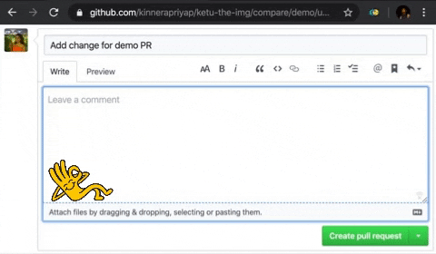

# Ketu the image!

Do you find yourself copy-pasting img tag and width attributes to replace default uploaded screenshot/image markdown in Github PRs?
Now use this chrome-extension to simplify your PR process...

### Usage 

Currently, this chrome extension is activated only for Github.

1. Drag and drop or select your image as usual
2. Once the image is uploaded, click on the extension.
3. Enter the required width of image and click on replace! :tada:

This extension can also be used to replace multiple images with img tag in GitHub PR markdown.

### Credits

Icons made by <a href="https://www.flaticon.com/authors/phatplus" title="phatplus">phatplus</a> from <a href="https://www.flaticon.com/" title="Flaticon">www.flaticon.com</a>